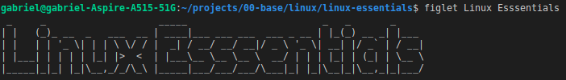

# Debian like systems
**Search packages by name:**
```bash
apt-cache search package_name
```

```bash
apt search package_name
```

## Install packages
**These commands below also resolve all the dependencies of the packages you are installing.**

>[**NOTE**]
> 
> This commands need to root privileges to work. For this reason, the 'sudo' command is ahead.

```bash
sudo apt-get install -y package_name
```

```bash
sudo apt install -y package_name
```
**Exemplo**
```bash
sudo apt-get install -y figlet
```

After the download is complete:
- all files are copied to the appropriate locations
- any additional configuration is performed
- the command becomes available



# Red Hat like systems
**Search packages by name:**
```bash
yum search package_name
```

```bash
dnf search package_name
```

**Search based in descritives terms**
```bash
dnf search speaking cow
```